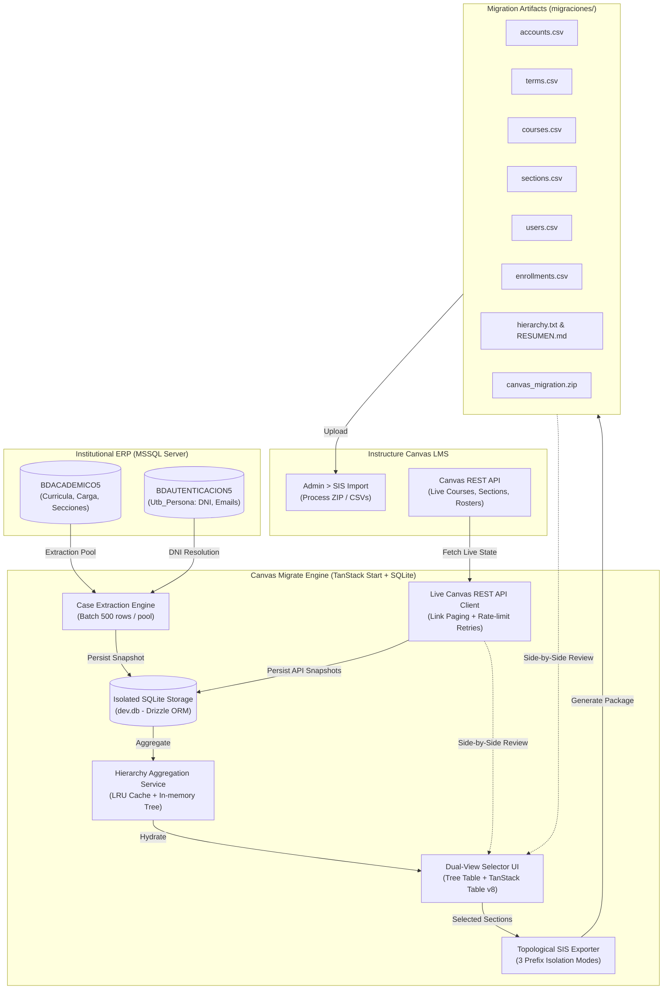

# Canvas Migrate

[](LICENSE)
[](https://www.typescriptlang.org/)
[](https://tanstack.com/start)
[](https://tailwindcss.com/)
[](https://orm.drizzle.team/)
[](https://canvas.instructure.com/)

> **Canvas Migrate** is a high-performance, full-stack migration and verification platform designed to bridge university academic ERP databases (Microsoft SQL Server `BDACADEMICO5` and `BDAUTENTICACION5`) directly into **Instructure Canvas LMS** via standard SIS CSV imports and REST API live synchronization.

---

## Table of Contents

- [Purpose & Key Problem Solved](#purpose--key-problem-solved)
- [Architecture & Data Pipeline](#architecture--data-pipeline)
- [Key Features](#key-features)
- [Interactive Workspaces & UI Tour](#interactive-workspaces--ui-tour)
  - [1. SQL Import Case Manager (`/#cases`)](#1-sql-import-case-manager-cases)
  - [2. Hierarchical Selection Workspace (`/#visualization`)](#2-hierarchical-selection-workspace-visualization)
  - [3. Canvas SIS Exporter & Sandbox Isolation](#3-canvas-sis-exporter--sandbox-isolation)
  - [4. Side-by-Side Comparison Workspace (`/#comparison`)](#4-side-by-side-comparison-workspace-comparison)
  - [5. Canvas LMS REST API Inspector (`/#canvas`)](#5-canvas-lms-rest-api-inspector-canvas)
- [Canvas LMS SIS Specifications & Normalization](#canvas-lms-sis-specifications--normalization)
- [Technology Stack](#technology-stack)
- [Getting Started](#getting-started)
  - [Prerequisites](#prerequisites)
  - [Installation & Setup](#installation--setup)
  - [Environment Variables](#environment-variables)
  - [Running the Application](#running-the-application)
- [Security & Secrets Policy](#security--secrets-policy)
- [Project Directory Structure](#project-directory-structure)

---

## Purpose & Key Problem Solved

Migrating massive academic course offerings, faculty rosters, and student enrollments from legacy relational ERPs to modern Learning Management Systems is often error-prone and fraught with risks:

1. **Teacher Identification Discrepancies**: ERPs often identify professors with email handles, sequential primary keys, or payroll codes. In Canvas LMS, authentic single-sign-on (SSO) and national accreditation require normalizing faculty identities to official **National Identification Numbers (DNI)**.
2. **Deep Academic Topologies**: Universities organize curricula across complex 5-level organizational hierarchies: `Campus (Sede) -> Modality -> Faculty -> Career -> Academic Plan`. Canvas requires this hierarchy to be strictly ordered and topologically sorted into parent-child subaccounts.
3. **Sandbox Contamination & ID Collisions**: Testing migrations in Canvas Sandbox environments can inadvertently move global campus subaccounts or overwrite courses and sections.
4. **Discrepancy Auditing**: Verifying whether what was exported from the ERP matches what actually exists on Canvas LMS previously required laborious manual script comparisons.

**Canvas Migrate** solves these challenges by providing:
- An isolated SQLite case database that preserves point-in-time extraction snapshots.
- A reactive hierarchical selector with 6-level cascading filters and dual-view presentation.
- An automated topological exporter generating standard Instructure SIS CSVs with 3 sandbox isolation modes.
- A side-by-side visual comparison workspace matching exported packages directly against live Canvas LMS API snapshots.

---

## Architecture & Data Pipeline



---

## Key Features

### 1. Multi-Database Extraction & Isolated Case Architecture
- Connects concurrently to multiple Microsoft SQL Server instances (`BDACADEMICO5` and `BDAUTENTICACION5`).
- Fast batch ingestion into an embedded SQLite database (`dev.db`), dumping both raw JSON tables and relational indexed records.
- Each migration case is completely segregated with an independent lifecycle (`import_cases`), allowing multiple academic periods and historical runs to co-exist without cross-contamination.

### 2. Hierarchical Data Selection & Cascading Filters
- **6-Level Cascading Filters**: Dynamically filters options based on parent selections:
  `Period -> Campus (Sede) -> Modality -> Faculty -> Career -> Academic Plan`.
- **Business Rule Filters**: Instantly toggle exclusion of sections marked `"NO HABILITADO"` and perform instant debounced global text searches.
- **Dual-View Switcher**:
  - **Nested Tree Table**: Expandable hierarchical tree rendering Accounts, Subaccounts, Courses, Sections, and Inline Rosters.
  - **TanStack Table (Detailed View)**: High-performance tabular data grid with multi-column sorting, row virtualization, and per-page expansion.
- **Granular Folding Controls**: Fold All, Campuses Level, Careers Level, Courses Level, and branch toggles with `Alt+Click` support.
- **Complete Inline Rosters**: Expand any course section to view:
  - **Teachers (D)**: Verified National ID (DNI), full name, and official institutional email.
  - **Students (E)**: Student university code, full name, and academic email.

### 3. Canvas SIS CSV Exporter & Sandbox Isolation Modes
- Emits fully validated, standard Instructure Canvas SIS CSV files:
  - `accounts.csv`, `terms.csv`, `courses.csv`, `sections.csv`, `users.csv`, `enrollments.csv`.
- Automatically compiles:
  - `hierarchy.txt`: Clean, human-readable tabbed tree diagram of the complete migration scope.
  - `RESUMEN.md`: Comprehensive technical audit report with row counts and file sizes.
  - `canvas_migration.zip`: Compressed archive ready for direct upload in Canvas Admin.
- **Optional Custom Root Subaccount**:
  - Automatically prepends an isolated root subaccount in `accounts.csv` (`parent_account_id: ""` or nested under an existing Canvas account).
- **3 Configurable Sandbox Isolation Modes**:
  | Mode | Behavior | Best Used For |
  | :--- | :--- | :--- |
  | **No prefix (`none` / "Sin prefijo")** | Standard SIS IDs (`S-001`, `CUR006380`, `7115-CUR006380`). | Production migrations & official deployments. |
  | **Prefix accounts (`accounts` / "Aplicar prefijo a cuentas")** | Prefixes subaccounts only (`TEST-5_S-001`, `TEST-5_P004084`), keeping courses & sections standard. | Sandbox testing without moving shared campus subaccounts. |
  | **Prefix all (`all` / "Aplicar prefijo a todos")** | Prefixes subaccounts, courses (`TEST-5_CUR006380`), sections (`TEST-5_7115-CUR006380`), and enrollments. | Total sandbox isolation with zero collisions across test runs. |

### 4. Canvas LMS REST API Live Sync & Account Inspector
- Connects directly to Canvas LMS REST API using Bearer Token authorization.
- Automated pagination via standard `Link` headers and exponential backoff retry handling.
- Real-time connection tester verifying token validity and API latency.
- Lazy-loads course sections and enrollments on-demand with SQLite local caching (`canvas_case_enrollments`).
- Visual account tree with live badges indicating SIS IDs, internal Canvas IDs, course tallies, and enrolled students.

### 5. Side-by-Side Comparison Workspace (`Migration vs Canvas API`)
- 50/50 dual-panel visual comparison interface:
  - **Left Panel**: Selected historical migration package (`migraciones/[period - timestamp]`).
  - **Right Panel**: Selected live Canvas LMS API snapshot (`canvas_import_cases`).
- **Synchronized Search**: A unified search bar simultaneously highlights and filters matching nodes in both trees.
- **Manual Exploratory Approach**: Eliminates noisy automated discrepancy warnings, allowing operators to freely inspect selective and partial migrations.
- **Single-Section Auto-Expansion**: Automatically expands courses containing a single section to reveal teacher and student rosters with zero extra clicks.

---

## Interactive Workspaces & UI Tour

The user interface is built on **shadcn/ui v4** with neutral **Gray** OKLCH tokens, **Geist Sans** typography, a collapsible left navigation drawer, and a full-width workspace shell:

```
┌─────────────────────────────────────────────────────────────────────────────┐
│  [≡] Canvas Migrate        [SQL Cases] [Visualization] [Comparison] [Canvas API] │
├─────────────────────────────────────────────────────────────────────────────┤
│                                                                             │
│  Workspace Views:                                                           │
│                                                                             │
│  1. SQL IMPORT CASE MANAGER (/#cases)                                       │
│     ├── Left: Catalog of database import cases & timestamps                 │
│     └── Right: Table inventory (20 tables), row counts & 50-row raw viewer  │
│                                                                             │
│  2. VISUALIZATION & SELECTION (/#visualization)                             │
│     ├── Top: Cascading 6-level filter bar & active selection summary        │
│     ├── Center: Dual-View switcher (Hierarchical Tree / TanStack Table)     │
│     └── Actions: "Select All", "Invert Selection", "Clear", "Export SIS"    │
│                                                                             │
│  3. SIDE-BY-SIDE COMPARISON (/#comparison)                                  │
│     ├── Top: Synchronized dual search & panel folding controls              │
│     ├── Left: Exported Migration Tree (migraciones/)                        │
│     └── Right: Live Canvas LMS API Tree (Snapshots)                         │
│                                                                             │
│  4. CANVAS LMS API CASES (/#canvas)                                         │
│     ├── Left: Snapshots extracted from Canvas REST API                      │
│     └── Right: Interactive account subaccount tree with lazy enrollment fetch│
│                                                                             │
└─────────────────────────────────────────────────────────────────────────────┘
```

### 1. SQL Import Case Manager (`/#cases`)
The entry landing screen. Allows operators to launch an extraction task from Microsoft SQL Server. It extracts 20 tables into SQLite, providing row counts, execution duration metrics, and an inline monospace modal to inspect raw record schemas.

### 2. Hierarchical Selection Workspace (`/#visualization`)
The core migration workshop. Filter down by term, campus, and study program, or search for a specific professor or course code. Checkboxes cascade seamlessly down from campus level to individual sections. Click any section row to expand inline badges showing assigned professors with normalized DNI and all enrolled students.

### 3. Canvas SIS Exporter & Sandbox Isolation
Triggered via the **"Exportar para Canvas" (Export for Canvas)** button once sections are selected. Displays a pre-flight modal summarizing unique courses, total sections, and estimated enrollments. Offers optional root subaccount creation and the 3 sandbox prefixing modes before outputting to `migraciones/[Period] - [Timestamp]/`.

### 4. Side-by-Side Comparison Workspace (`/#comparison`)
Compare any generated migration package against any Canvas LMS API snapshot. Allows operators to visually audit whether courses were published under the right subaccounts, whether teachers were properly assigned, and whether students were successfully enrolled.

### 5. Canvas LMS REST API Inspector (`/#canvas`)
Manage real-time cloud snapshots pulled from Canvas LMS. Includes a connection tester, account tree explorer, and on-demand roster synchronization that caches enrolled users directly into SQLite.

---

## Canvas LMS SIS Specifications & Normalization

The system strictly adheres to the official **Instructure Canvas SIS Import CSV Format**:

### Generated File Schemas

| File | Primary Key | Parent Reference | Key Fields |
| :--- | :--- | :--- | :--- |
| `accounts.csv` | `account_id` | `parent_account_id` | `name`, `status` (`active`) |
| `terms.csv` | `term_id` | - | `name`, `status`, `date_start`, `date_end` |
| `courses.csv` | `course_id` | `account_id`, `term_id` | `short_name`, `long_name`, `course_format` (`online`) |
| `sections.csv` | `section_id` | `course_id` | `name`, `status` (`active`) |
| `users.csv` | `user_id` | - | `login_id`, `first_name`, `last_name`, `email`, `status` |
| `enrollments.csv` | - | `course_id`, `section_id`, `user_id` | `role` (`teacher` \| `student`), `status` (`active`) |

### Identity Normalization Rules
- **Faculty (`role: teacher`)**:
  - `user_id`: Normalized **National Identity Document (DNI)** resolved from `BDAUTENTICACION5.Personal.Utb_Persona` (e.g., `09375116`).
  - `login_id`: Official university email or corporate handle.
- **Students (`role: student`)**:
  - `user_id`: Official university student code (e.g., `26011121010074`).
  - `login_id`: Institutional student email address.
- **Class Sections**:
  - `section_id`: Compound key `<seccion_id>-<course_id>` (e.g., `7115-CUR006380`) to guarantee uniqueness across multiple groups and study terms.

---

## Technology Stack

- **Framework**: [TanStack Start](https://tanstack.com/start) (Full-stack SSR with React 19 and Vite)
- **Routing**: [TanStack Router](https://tanstack.com/router) with file-based routing and type-safe server functions
- **Data Table Engine**: [@tanstack/react-table](https://tanstack.com/table) (v8)
- **Styling**: [Tailwind CSS v4](https://tailwindcss.com/) with `@tailwindcss/vite`
- **UI Components**: [shadcn/ui](https://ui.shadcn.com/) (v4 Gray tokens in OKLCH, Radix UI primitives, Lucide React icons)
- **Typography**: [Geist Sans](https://fontsource.org/fonts/geist-sans)
- **Database**: [SQLite](https://www.sqlite.org/) (`better-sqlite3` with WAL mode and foreign key integrity)
- **ORM**: [Drizzle ORM](https://orm.drizzle.team/) with `drizzle-kit` migrations
- **Relational ERP Driver**: [`mssql`](https://www.npmjs.com/package/mssql) (TDS driver for Microsoft SQL Server)
- **Canvas LMS Client**: Native Node.js `fetch` with exponential backoff and `Link` header pagination

---

## Getting Started

### Prerequisites

- **Node.js**: `v20.0.0` or higher (`v22+` / `v25+` recommended)
- **npm** or **pnpm**
- **SQLite3** (system library or Node bundled)
- Access to source Microsoft SQL Server instances (`BDACADEMICO5` & `BDAUTENTICACION5`)
- Canvas LMS API Bearer Token (for live synchronization)

### Installation & Setup

1. **Clone the repository**:
   ```bash
   git clone https://github.com/your-username/canvas-migrate.git
   cd canvas-migrate
   ```

2. **Install dependencies**:
   ```bash
   npm install
   ```

3. **Configure Environment**:
   Copy the example environment file:
   ```bash
   cp .env.example .env.local
   ```
   Edit `.env.local` with your database credentials and Canvas token.

4. **Initialize Database Schema**:
   Push the Drizzle ORM schema to your local SQLite database (`dev.db`):
   ```bash
   npx drizzle-kit push
   ```

### Environment Variables

Configure the following variables in `.env.local`:

```env
# Local SQLite Database
DATABASE_URL="dev.db"

# Source Microsoft SQL Server (Academic Database)
DB_SERVER=localhost
DB_PORT=1433
DB_USER=sa
DB_PASSWORD="your_database_password"
DB_NAME=BDACADEMICO5

# Source Microsoft SQL Server (Authentication & Person Database)
UP_DB_USER=sa
UP_DB_PASSWORD="your_database_password"
UP_DB_NAME=BDAUTENTICACION5

# Canvas LMS REST API
CANVAS_API_ENDPOINT=https://your-institution.instructure.com/
CANVAS_API_KEY=your_canvas_api_bearer_token

# Optional Business Rule Flags
INCLUDE_NO_HABILITADO_SECTIONS=false
EXPORT_ALL_COURSES=true
```

### Running the Application

- **Development Mode**:
  ```bash
  npm run dev
  ```
  Open [http://localhost:3000](http://localhost:3000) in your browser.

- **Type Check**:
  ```bash
  npx tsc --noEmit
  ```

- **Production Build**:
  ```bash
  npm run build
  ```

- **Start Production Server**:
  ```bash
  npm run start
  ```

---

## Security & Secrets Policy

This repository strictly enforces zero-credential leaks:
- Local database files (`dev.db`, `dev.db-wal`, `dev.db-shm`) are excluded via `.gitignore`.
- Environment secrets (`.env`, `.env.local`) are strictly gitignored.
- Generated migration packages (`migraciones/*`) containing real student and faculty data are gitignored.
- All code fallbacks utilize empty strings or environment variable references; no default passwords or test tokens exist in source code.

---

## Project Directory Structure

```
canvas-migrate/
├── docs/
│   └── CANVAS_REFERENCE.md      # Detailed source architecture & SIS specifications
├── migraciones/                 # Target folder for generated Canvas SIS packages (gitignored)
├── src/
│   ├── components/
│   │   ├── canvas/              # Canvas REST API Case Manager & Tree visualizer
│   │   ├── cases/               # SQL Extraction Case Manager & Top-50 Raw Inspector
│   │   ├── comparison/          # Side-by-side migration vs Canvas API workspace
│   │   ├── hierarchy/           # Selection workspace, filters, tree table & TanStack table
│   │   │   └── modals/          # Export dialog, student inspector, summary dialog
│   │   ├── layout/              # Header, navigation drawer, theme provider
│   │   └── ui/                  # shadcn/ui components (Sheet, Dialog, Table, Badges, etc.)
│   ├── db/
│   │   ├── index.ts             # Drizzle ORM client with better-sqlite3
│   │   └── schema.ts            # Relational schema for SQL cases & Canvas API snapshots
│   ├── server/
│   │   ├── functions/           # TanStack Start server RPC functions
│   │   │   ├── canvas.ts        # Canvas API RPCs
│   │   │   ├── cases.ts         # SQL extraction & sample data RPCs
│   │   │   ├── hierarchy.ts     # Hierarchy tree resolution RPCs
│   │   │   └── migrations.ts    # Migration package listing & tree parser RPCs
│   │   └── services/            # Core backend business logic
│   │   │   ├── canvas-audit-service.ts
│   │   │   ├── canvas-exporter.ts      # SIS CSV compilation, zip generation & sandbox modes
│   │   │   ├── canvas-importer.ts      # REST API pagination, rate-limits & enrollment fetch
│   │   │   ├── db-helpers.ts           # SQLite batch insert helpers
│   │   │   ├── hierarchy-service.ts    # Multi-level tree assembly & LRU caching
│   │   │   ├── importer.ts             # MSSQL extraction pipeline
│   │   │   ├── migration-service.ts    # Reads & structures migraciones/ folders
│   │   │   └── sql-server.ts           # MSSQL Connection pool manager
│   ├── routes/
│   │   ├── __root.tsx           # Application layout shell & global providers
│   │   └── index.tsx            # Single-page multi-tab router (cases, visualization, comparison, canvas)
│   ├── router.tsx               # TanStack Router configuration
│   └── styles.css               # Tailwind CSS v4 OKLCH Gray tokens & Geist font import
├── drizzle.config.ts            # Drizzle kit configuration
├── package.json                 # Project dependencies & scripts
├── tsconfig.json                # TypeScript strict configuration
└── vite.config.ts               # Vite bundler & TanStack Start plugin configuration
```

---

## License

This project is licensed under the MIT License. See [LICENSE](LICENSE) for details.
