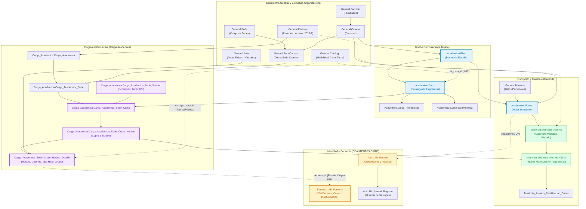
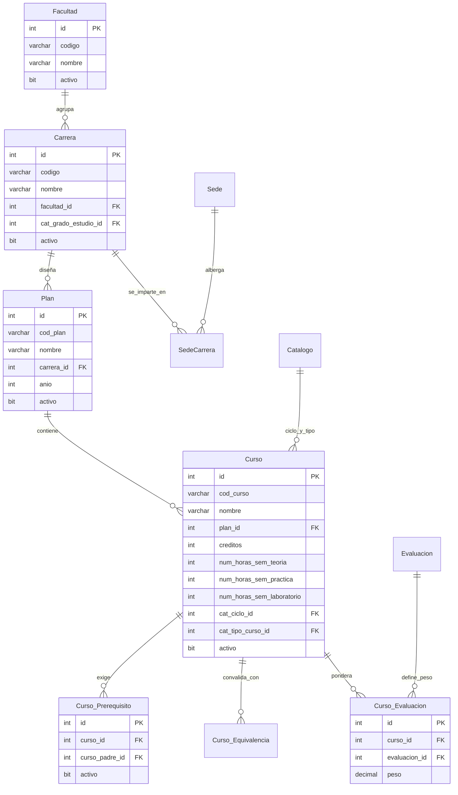
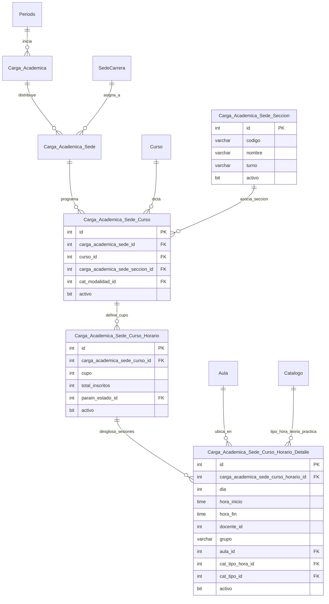
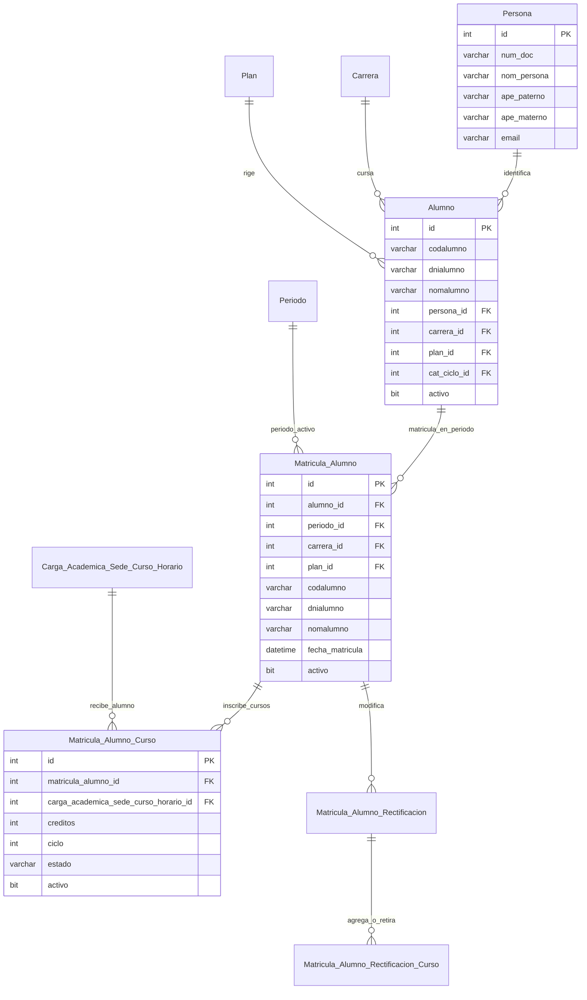
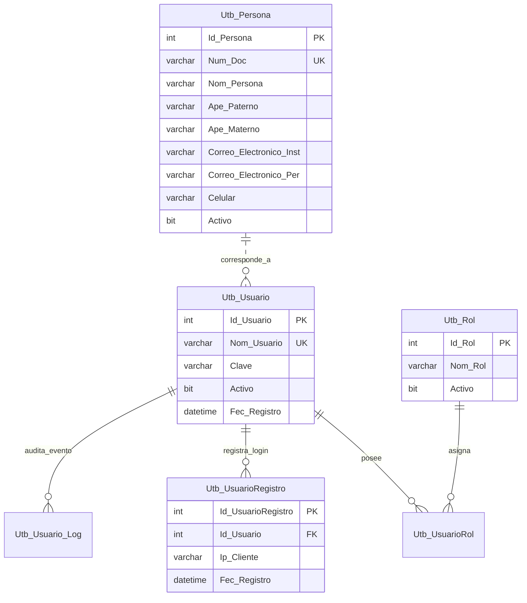
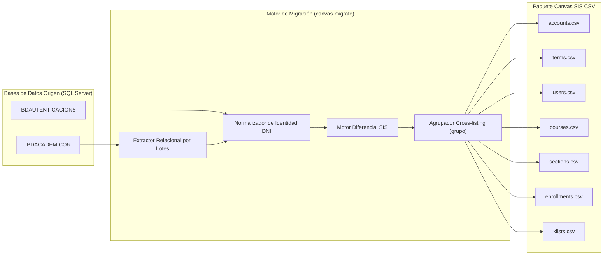

# DIAGRAMAS ENTIDAD-RELACIÓN: ECOSISTEMA ACADÉMICO Y AUTENTICACIÓN

> **Documento Oficial de Modelado y Arquitectura de Datos**
> Diagramas conceptuales, lógicos y relacionales de **`BDACADEMICO6`** y **`BDAUTENTICACION5`**.

---

## 1. Diagrama Maestro de Arquitectura y Flujo de Datos

Visualiza la relación integral entre la estructura curricular, la programación horaria semestral, la matrícula de alumnos y la autenticación docente.

---

## 2. Diagrama ER: Malla Curricular y Estructura Académica

Detalla cómo se relacionan los planes de estudio, asignaturas, prerequisitos y facultades.

---

## 3. Diagrama ER: Carga Académica, Horarios y Cross-listing

Modela las secciones de clase, la asignación de profesores, días lectivos y los grupos de aulas compartidas.

> **Regla de Cross-listing en `Carga_Academica_Sede_Curso_Horario_Detalle`**:
> La columna `grupo` (ej. `EEGG_CCM1D01`) agrupa múltiples secciones de diferentes carreras que comparten exactamente el mismo profesor, aula y horario semanal. Esto genera en Canvas SIS el archivo `xlists.csv` y el contenedor unificado `GRP_<grupo>`.

---

## 4. Diagrama ER: Matrícula e Inscripción Estudiantil

Modela cómo un alumno matriculado se conecta con sus asignaturas del semestre.

> **Resolución Clave de Matrícula**:
> `Matricula.Matricula_Alumno_Curso.matricula_alumno_id` referencia directamente a `Matricula.Matricula_Alumno.id` (la cabecera semestral), y desde allí se accede a `alumno_id` (`Academico.Alumno`) y a `persona_id` (`General.Persona`), garantizando exactitud absoluta en los 95,656 registros.

---

## 5. Diagrama ER: Autenticación, Docentes y Seguridad (`BDAUTENTICACION5`)

Modela la infraestructura de identidad docente y seguridad de acceso.

---

## 6. Mapeo de Flujo de Datos hacia Instructure Canvas LMS

